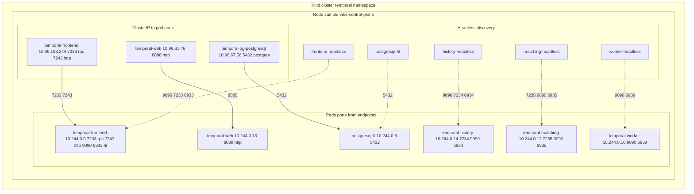

# Temporal on Kind - network diagram

Topology from `kubectl describe svc`, `kubectl get endpoints`, and `kubectl get pods -o wide` in namespace `temporal`.

If you only see a **code block** below: Cursor and VS Code Markdown preview only renders Mermaid when you install an extension such as **Markdown Preview Mermaid Support**. GitHub renders `mermaid` fenced blocks on push.

## ClusterIP reference

| Service                  | ClusterIP      | Service ports -> pod       |
|--------------------------|----------------|----------------------------|
| temporal-frontend        | 10.96.193.244  | 7233 7243 -> `10.244.0.9` |
| temporal-web             | 10.96.61.46    | 8080 -> `10.244.0.13`      |
| temporal-pg-postgresql   | 10.96.67.56    | 5432 -> `10.244.0.6`       |

## Headless endpoints reference

| Service                     | Pod IP      | Ports              |
|-----------------------------|-------------|--------------------|
| temporal-frontend-headless  | 10.244.0.9  | 9090 7233 6933     |
| temporal-history-headless   | 10.244.0.14 | 9090 7234 6934     |
| temporal-matching-headless  | 10.244.0.12 | 7235 9090 6935     |
| temporal-worker-headless    | 10.244.0.10 | 9090 6939          |
| temporal-pg-postgresql-hl   | 10.244.0.6  | 5432               |

**Note:** Pod and ClusterIP addresses change after redeploys; refresh from the cluster if this doc drifts.
